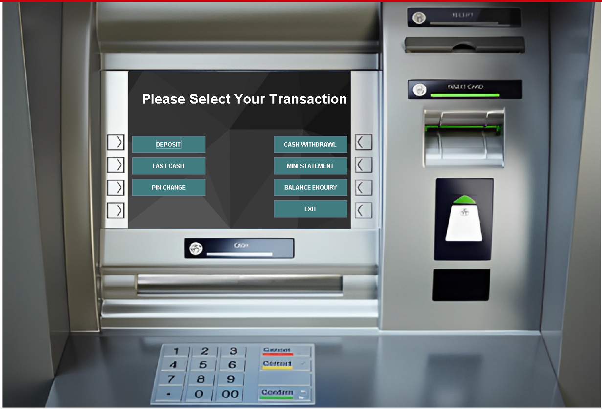

# Banking Management System

# 💳 ATM-Simulator-System 

A desktop-based **Banking Management System** developed in **Java** using **Swing for GUI** and **JDBC for database connectivity**. This project mimics core ATM/banking functionalities including login, deposit, withdrawal, balance check, and mini statements.

---

## 🧰 Tech Stack

- **Java (Swing, JDBC)**
- **MySQL Database**
- **IntelliJ IDEA / Eclipse**

---

## 📌 Key Features

### 🧾 Authentication
- **Login with Card Number & PIN** (`Login.java`)
- **New User Registration** (Signup Pages 1, 2, 3)

### 🧑‍💼 Registration
- Collects **personal**, **financial**, and **account** info
- Auto-generates:
  - **16-digit Card Number**
  - **4-digit PIN**
- Select account type and services (ATM, Net Banking, etc.)

### 🏦 Banking Operations (via `main_Class.java`)
- 💰 **Deposit**
- 💸 **Cash Withdrawal**
- ⚡ **Fast Cash** (Predefined values)
- 🧾 **Mini Statement** (`mini.java`)
- 💼 **Balance Inquiry** (`BalanceEnquriy.java`)
- 🔐 **PIN Change**
- ❌ **Exit**

### 📄 Mini Statement
- Lists all transactions with date, type, and amount
- Shows masked card number and current balance

### 🛢️ Database Tables Used
- `signup`
- `signuptwo`
- `signupthree`
- `login`
- `bank`

---

## ⚙️ How to Run

```bash
# 1. Clone the Repository
git clone https://github.com/your-username/Banking-Management-System.git

# 2. Open in Eclipse / IntelliJ

# 3. Create MySQL Database
CREATE DATABASE bankmanagementsystem;

# 4. Create Tables (signup, signuptwo, signupthree, login, bank)
# You'll need to create them manually based on insert queries in the code.

# 5. Update your MySQL credentials in Connn.java

# 6. Run `Login.java` to start the application
```

## 🧠 Code Structure

| File                    | Purpose                          |
|-------------------------|----------------------------------|
| `Signup.java`           | Page 1: Personal Info            |
| `Signup2.java`          | Page 2: Financial & Identity Info|
| `Signup3.java`          | Page 3: Account Setup            |
| `Login.java`            | Login GUI                        |
| `main_Class.java`       | Transaction Dashboard            |
| `Deposit.java` / `Withdrawl.java` | Transaction modules    |
| `FastCash.java`         | Fast withdraw options            |
| `mini.java`             | Mini Statement                   |
| `BalanceEnquriy.java`   | Check Balance                    |
| `Pin.java`              | Change PIN                       |
| `Connn.java`            | DB Connection setup              |


## 📸 Screenshots

> 📁 Directory structure:
>
> ```
> Banking-Management-System/
> ├── screenshots/
> │   ├── login.png
> │   ├── signup.png
> │   ├── deposit.png
> │   ├── withdrawal.png
> │   ├── fastcash.png
> │   ├── changepin.png
> │   ├── ministatement.png
> │   ├── balanceenquiry.png
> ```
<h2>🖼️ Screenshots</h2>

<table>
  <tr>
    <td align="center">
      <br/>
      <b>Login</b>
    </td>
    <td align="center">
      <br/>
      <b>Signup</b>
    </td>
    <td align="center">
      <br/>
      <b>Deposit</b>
    </td>
    <td align="center">
      <br/>
      <b>Withdrawal</b>
    </td>
  </tr>
  <tr>
    <td align="center">
      <br/>
      <b>Fast Cash</b>
    </td>
    <td align="center">
      <br/>
      <b>Change PIN</b>
    </td>
    <td align="center">
      <br/>
      <b>Mini Statement</b>
    </td>
    <td align="center">
      <br/>
      <b>Balance Enquiry</b>
    </td>
  </tr>
</table>

---

## 👨‍💻 Author

**Ravishankar Kumar**  
💼 Java Developer | 💻 Software Enthusiast  

📧 Email: [ravishankarmahto887752@gmail.com](mailto:ravishankarmahto887752@gmail.com)  
🌐 GitHub: [RavishankarMahto](https://github.com/RavishankarMahto)

---


